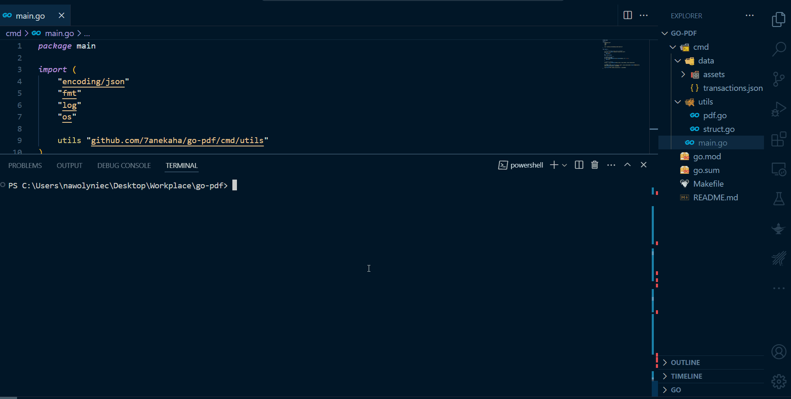

# PDF invoice generator
PDF invoice generated from a JSON file using pure GO


## Pre-requisites
1. Go 1.22
2. Make

## Usage
1. Run make command to build the project
```bash
make build
```
2. Run the generated binary file
```bash
./invoice-generator.exe
```
3. The generated PDF file will be saved in the root directory of the project
4. (Extra) Change the JSON file to generate a different invoice

## Demo

